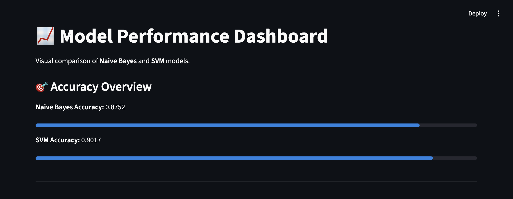
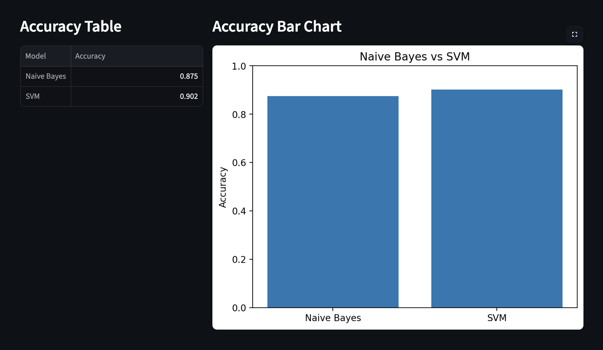
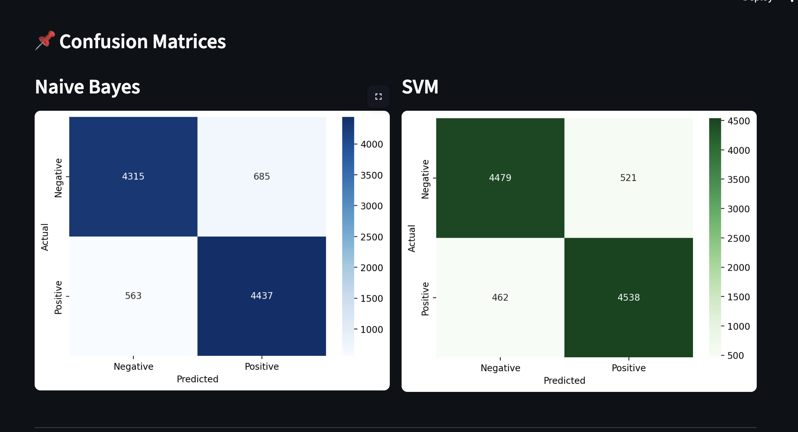
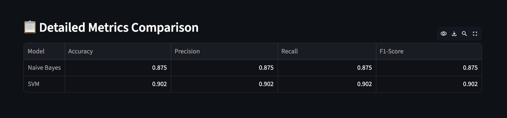
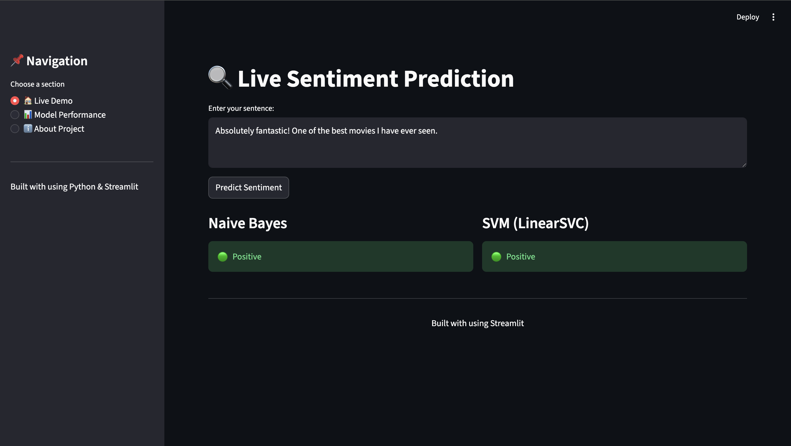

# Sentiment Analysis Dashboard (Naive Bayes vs SVM)

[](https://sentiment-analysis-nb-svm-dashboard.streamlit.app)
[]()
[]()
[]()

An end-to-end **Machine Learning project** that classifies text as **Positive (1)** or **Negative (0)** using:

* Naive Bayes
* Support Vector Machine (SVM)

Includes an interactive **Streamlit dashboard** for real-time prediction and model comparison.

---

## Live Demo

**Live Application:**  
https://sentiment-analysis-nb-svm-dashboard.streamlit.app

---

## Features

* TF-IDF based text vectorization
* Two ML models (Naive Bayes & SVM)
* Real-time sentiment prediction
* Accuracy comparison
* Confusion matrix visualization
* Detailed metrics (Precision, Recall, F1-score)
* Interactive Streamlit UI

---

## Project Structure

```
SentimentAnalysisProject/
│
├── src/
│   └── main.py
│
├── models/
│   ├── nb_model.pkl
│   ├── svm_model.pkl
│   ├── tfidf.pkl
│   └── metrics.pkl
│
├── app.py
├── movie_data.csv
├── assets/
│   ├── dashboard.png
│   ├── accuracy.png
│   ├── confusion.png
│   ├── metrics.png
│   └── live_prediction.png
│
└── README.md
```

---

## Results

| Model       | Accuracy |
| ----------- | -------- |
| Naive Bayes | 87.52%   |
| SVM         | 90.17%   |

**SVM performs better overall**

---

## Application Screenshots

### 🔹 Model Performance Dashboard

---

### 🔹 Accuracy Comparison

---

### 🔹 Confusion Matrices

---

### 🔹 Detailed Metrics

---

### 🔹 Live Sentiment Prediction

---

## How to Run

### Install dependencies

```
pip install pandas scikit-learn matplotlib seaborn streamlit
```

### Train models

```
python src/main.py
```

### Run Streamlit app

```
streamlit run app.py
```

Open in browser:

```
http://localhost:8501
```

---

## Example Inputs

**Positive**

* I absolutely loved this movie!

**Negative**

* This was a complete waste of time.

**Mixed**

* The story was good but the execution was poor.

---

## Approach

* Text preprocessing
* TF-IDF vectorization
* Model training (NB & SVM)
* Evaluation using:

  * Accuracy
  * Precision
  * Recall
  * F1-score
  * Confusion Matrix

---

## Tech Stack

* Python
* Scikit-learn
* Pandas
* Matplotlib & Seaborn
* Streamlit

---

## Author

**Dhanvi Annam**
B.Tech Computer Science Engineering  

---

## License

For academic and learning purposes.
